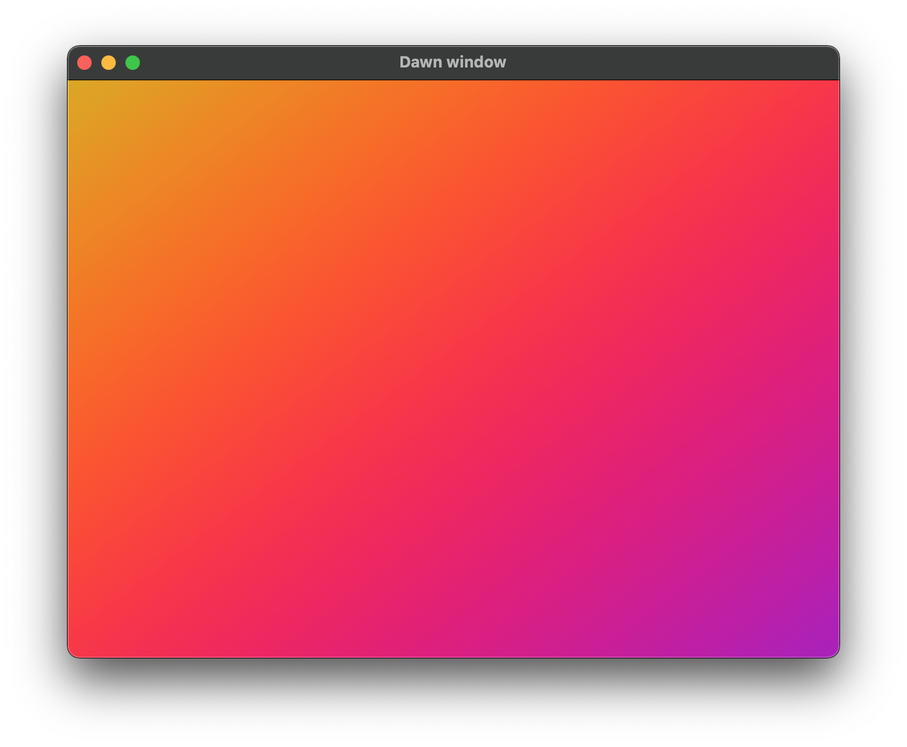

# [wip] webgputoy

WebGPU shader toy. Uses mach-dawn for rendering a wgsl pipeline.



## Build

Includes are missing (TODO). Download them manually and add them to libs!
Also `git submodule init` to get `mach-glfw` ziggified bindings.

```sh
$ tree -L 2 libs/
libs/
├── extern
│   ├── compat.h
│   ├── futureproof.h
│   └── preview.h
├── include
│   ├── dawn
│   ├── dawn_native_mach.cpp
│   ├── dawn_native_mach.h
│   ├── tint
│   └── webgpu
├── libdawn.a
└── mach-glfw
    ├── LICENSE
    ├── LICENSE-APACHE
    ├── LICENSE-MIT
    ├── README.md
    ├── build.zig
    ├── src
    ├── system_sdk.zig
    ├── update-upstream.sh
    └── upstream

8 directories, 13 files
```

- [arch_debug.tar.gz](https://github.com/hexops/mach-gpu-dawn/releases)
- [dawn_native_mach.cpp](https://github.com/hexops/mach/blob/main/gpu-dawn/src/dawn/dawn_native_mach.cpp)
- [dawn_native_mach.h](https://github.com/hexops/mach/blob/main/gpu-dawn/src/dawn/dawn_native_mach.h)

## Refs
- [WebGPU](https://gpuweb.github.io/gpuweb/wgsl/#resource-interface)
